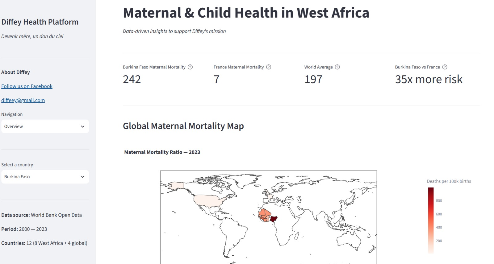
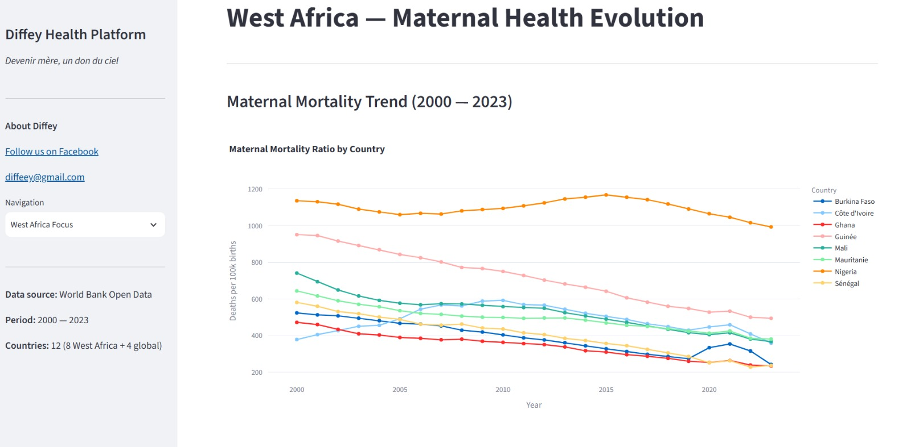
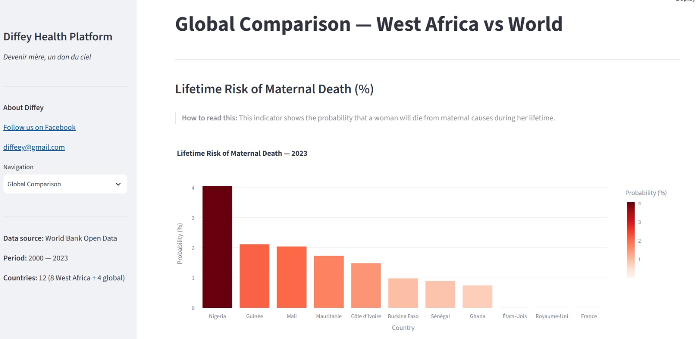
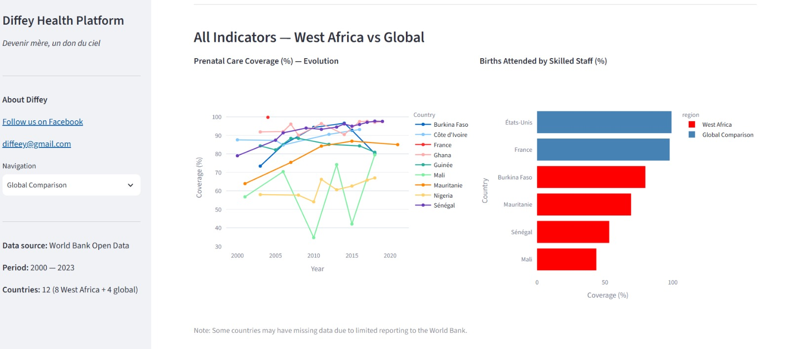

# 🤱 Diffey Health Data Platform

> *"Devenir mère, un don du ciel"*

A data engineering platform analyzing maternal and child health indicators 
across West Africa, built to support the **Diffey project** — a community 
initiative helping women navigate their pregnancy journey safely.

## The Problem

Every day, women in West Africa face a reality that should not exist in 2024:

| Country | Maternal Mortality (per 100k births) | vs France |
|---------|--------------------------------------|-----------|
| Guinea  | 494                                  | 71x more risk |
| Nigeria | 1,001                                | 143x more risk |
| Mali    | 354                                  | 51x more risk |
| France  | 7                                    | baseline |

This platform transforms raw World Bank data into actionable insights 
to support decision-makers, NGOs, and health professionals.

## Architecture

## Tech Stack

| Tool | Purpose |
|------|---------|
| Python | Data extraction and pipeline orchestration |
| requests | World Bank API calls |
| dbt | SQL transformations, testing, documentation |
| DuckDB | Analytical storage |
| Streamlit | Interactive dashboard |
| Plotly | Data visualization and maps |
| Parquet | Columnar storage format |

## Health Indicators

| Indicator | World Bank Code | Unit |
|-----------|----------------|------|
| Maternal Mortality Ratio | SH.STA.MMRT | per 100k live births |
| Infant Mortality Rate | SP.DYN.IMRT.IN | per 1k live births |
| Prenatal Care Coverage | SH.STA.ANVC.ZS | % of pregnant women |
| Skilled Birth Attendance | SH.STA.BRTC.ZS | % of total births |
| Lifetime Risk of Maternal Death | SH.MMR.RISK.ZS | probability (%) |

## Countries Covered

**West Africa:** Guinea, Senegal, Mali, Côte d'Ivoire, Burkina Faso, 
Ghana, Nigeria, Mauritania

**Global Comparison:** France, United Kingdom, United States, World Average

## Project Structure

## Getting Started

### Prerequisites
- Python 3.12+
- dbt-duckdb

### Installation

```bash
git clone https://github.com/SalimaYoula/diffey-health-platform.git
cd diffey-health-platform

python3 -m venv venv
source venv/bin/activate
pip install -r requirements.txt
```

### Run the Pipeline

```bash
# 1. Extract data from World Bank API
python3 extraction/extract.py

# 2. Run dbt transformations
cd dbt_diffey
dbt run
dbt test

# 3. Launch dashboard
cd ..
streamlit run dashboard/app.py
```

Open **http://localhost:8501** in your browser.

## Dashboard Preview

### Overview — Global Map


### West Africa Focus


### Global Comparison 1


### Global Comparison 2


## About Diffey

Diffey (*"child"* in Soussou language) is a community platform created 
by three sisters to support women in their journey to motherhood, 
focusing on West African maternal health challenges.

🌍 **Follow Diffey:**
- Facebook: [facebook.com/Diffeyy](https://www.facebook.com/Diffeyy)
- Email: [diffeey@gmail.com](mailto:diffeey@gmail.com)

## Author

Salematou Youla — Data Engineer
[LinkedIn](https://www.linkedin.com/in/salematou-youla-b7784790) | 
[GitHub](https://github.com/SalimaYoula)